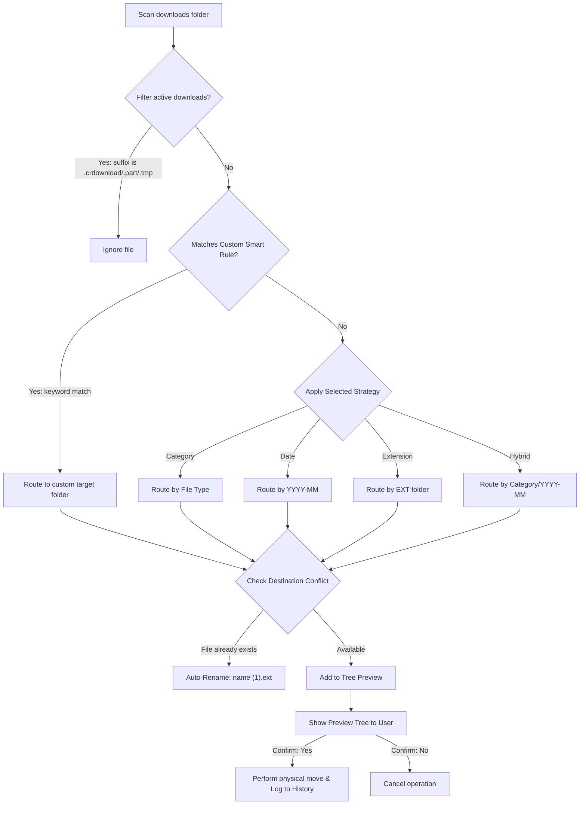

# 🗄️ Cabinet CLI

[](#)
[](#)
[](#)

A beautiful, lightning-fast, and interactive command-line interface (CLI) tool written in Python to automatically organize and declutter your `Downloads` directory. 

---

## 🎨 Visual Overview

Here is how **Cabinet** processes and organizes your unstructured files:

### 📥 The Problem: Messy Downloads Folder
```text
~/Downloads/
├── 📄 invoice_may_2026.pdf
├── 📄 vacation_photo.heic
├── 📄 main.py
├── 📄 script.sh
├── 📄 backup.tar.gz
├── 📄 temporary_file.crdownload   <-- (Active download, ignored!)
└── 📄 draft_logo.psd
```

### ⚙️ Processing Pipeline


### 📤 The Result: Structured Organization
```text
~/Downloads/
├── 📁 Images/
│   └── 📄 vacation_photo.heic
├── 📁 Documents/
│   ├── 📁 Factures/               <-- (Custom Smart Rule output!)
│   │   └── 📄 invoice_may_2026.pdf
│   └── 📄 cv.pdf
├── 📁 Code/
│   ├── 📄 main.py
│   └── 📄 script.sh
├── 📁 Archives/
│   └── 📄 backup.tar.gz
└── 📁 Design/
    └── 📄 draft_logo.psd
```

---

## ✨ Features

*   **⚡ 1-Click Sorting:** Instant organization of files left at the root of your downloads.
*   **👁️ Tree Preview:** Shows a beautiful terminal directory tree (`rich.tree`) mapping where files will go before moving them.
*   **🛡️ Safety First:** 
    *   **Undo/Revert:** One-click rollback restores files to their original location.
    *   **Conflict Resolution:** Auto-renames files with naming collisions (e.g. `file (1).pdf`) instead of overwriting.
    *   **Filter Active Downloads:** Safely ignores temporary browser download files (`.crdownload`, `.part`, `.tmp`, `.download`).
*   **🔀 4 Sorting Strategies:**
    1.  **Category:** Images, Documents, Code, Archives, Videos, Audio, Design, Applications, and Misc.
    2.  **Date:** Groups files into `YYYY-MM/` folders.
    3.  **Extension:** Groups files into `PNG/`, `PDF/`, `ZIP/`, etc.
    4.  **Hybrid:** Groups by Category first, then by `YYYY-MM/` sub-folders.
*   **⚙️ Custom Smart Rules:** Define patterns in `rules.json` (e.g., match `"facture"` and direct it to `Documents/Factures/`) which take absolute priority.
*   **📊 Disk Usage Stats:** Colorful terminal bar graphs showing you exactly how much disk space is consumed by each file category.

---

## 🚀 Quick Start & Installation

### Option 1: Global Installation with Pipx (Recommended)

Install Cabinet globally in an isolated environment so it doesn't conflict with system packages:

```bash
pipx install .
```

*Ensure your local bin path is on your environment path (if not, run `pipx ensurepath`).*

Now, launch the cabinet interface from anywhere:
```bash
cabinet
```

### Option 2: Isolated Virtual Environment

If you prefer installing dependencies locally:

1.  **Create and activate virtual environment:**
    ```bash
    python3 -m venv .venv
    source .venv/bin/activate
    ```
2.  **Install dependencies and package:**
    ```bash
    pip install .
    ```
3.  **Run:**
    ```bash
    cabinet
    ```

---

## 📖 Usage Guide

When you run `cabinet`, you will be greeted by an interactive menu:

```text
  Menu Principal :
  1. Classer par Catégorie (ex: Images, Documents, Code...)
  2. Classer par Date (ex: Année-Mois/)
  3. Classer par Extension (ex: PNG/, PDF/, ZIP/)
  4. Classer en mode Hybride (ex: Images/Année-Mois/)
  5. Annuler le dernier rangement (Undo)
  6. Trouver et supprimer les doublons
  7. Nettoyer/Archiver les vieux fichiers
  8. Gérer les règles personnalisées (Smart Rules)
  9. Statistiques de l'espace disque (Graphique)
  10. Quitter
```

### ⏪ Reverting a Run (Undo)
Made a mistake? Select **Option 5 (Undo)**. The system reads the session cache file (`~/.cabinet_history.json`), moves the files back, and deletes any empty folders created.

### 🔍 Finding & Cleaning Duplicates
Select **Option 6**. Cabinet compares SHA-256 signatures of all files. It keeps the first copy and moves duplicates to the macOS native Trash bin (`~/.Trash`), allowing you to inspect them before emptying.

### 🧹 Archive Old Files
Select **Option 7**. Enter file age threshold (e.g., `30` days). Choose to either compress them into a unified `.zip` archive or directly move them to the macOS Trash bin.

### ⚙️ Managing Smart Rules
Select **Option 8**. You can add rules dynamically from the command line. Rules are saved in JSON format under `~/.config/cabinet/rules.json`.

---

## 🔧 File Categorization Map

The default rules mapped in [`cabinet/config.py`](file:///Users/moussandou/Code/Organized/cabinet/config.py) cover:

*   **Images:** `.jpg`, `.jpeg`, `.png`, `.gif`, `.bmp`, `.svg`, `.webp`, `.heic`, `.tiff`, `.raw`, `.psd`
*   **Documents:** `.pdf`, `.docx`, `.doc`, `.xlsx`, `.xls`, `.pptx`, `.ppt`, `.odt`, `.rtf`, `.txt`, `.csv`, `.md`, `.pages`, `.numbers`, `.key`
*   **Code:** `.py`, `.js`, `.ts`, `.tsx`, `.jsx`, `.html`, `.css`, `.json`, `.xml`, `.yaml`, `.yml`, `.sh`, `.bash`, `.sql`, `.rs`, `.go`, `.c`, `.cpp`, `.h`, `.java`, `.kt`, `.swift`, `.php`, `.rb`
*   **Audio:** `.mp3`, `.wav`, `.aac`, `.flac`, `.ogg`, `.m4a`, `.wma`
*   **Video:** `.mp4`, `.mkv`, `.mov`, `.avi`, `.webm`, `.flv`, `.mpeg`, `.mpg`
*   **Archives:** `.zip`, `.tar.gz`, `.tar`, `.rar`, `.7z`, `.dmg`, `.pkg`, `.iso`, `.gz`
*   **Design:** `.ai`, `.fig`, `.sketch`, `.xd`, `.indd`
*   **Applications:** `.app`, `.exe`, `.msi`
